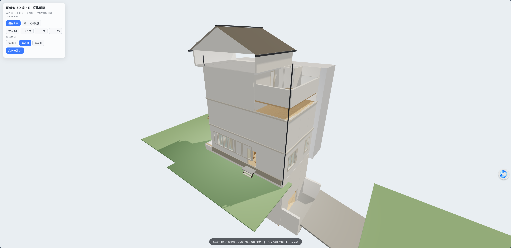
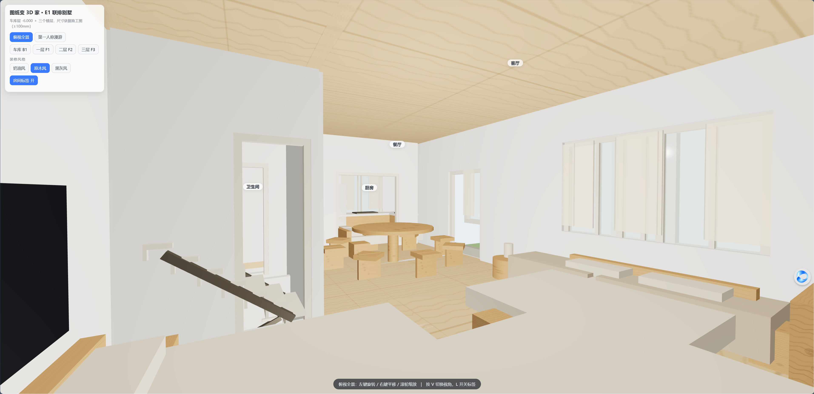
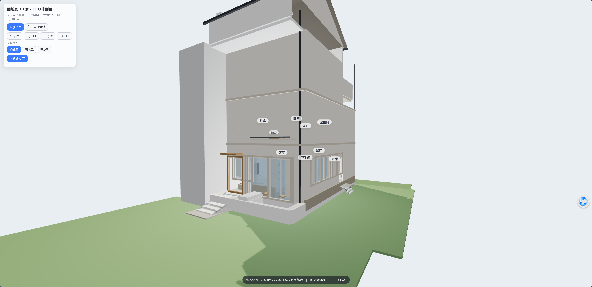

# 图纸变 3D 家 · Drawings to a Walkable Home

把一套三层联排别墅的施工图（一层平面图 / 二层平面图 / 1-1 剖面图），交给 **豆包工作**（内置模型 **Seed-2.1-pro 0915**）：

> 识图 → 3D 建模 → 装修风格切换 → 预算清单 / 图纸讲解，全程对话完成，四轮总计约 **2 小时 07 分**。

## 在线体验

开启 GitHub Pages 后直接访问：<https://xsc31966931.github.io/Drawing/>

也可以双击 `index.html` 本地打开（Three.js 走 CDN，需联网）。

| 原木风 · 俯视全景 | 原木风 · 一层客餐厅 |
|---|---|
|  |  |

## 功能

- **按施工图尺寸建模**：车库层 -6.000 / 一层 ±0.000 / 二层 3.200 / 三层 6.200 / 屋脊 12.900，含坡屋顶、三跑楼梯、下沉车道 + 坡道、采光井
- **两种视角**：第一人称漫游（WASD + 鼠标视角，Shift 加速）/ 俯视全景（OrbitControls），V 键切换
- **房间标签**：俯视时自动避让遮挡，L 键开关；楼层按钮直达对应层
- **三种装修风格一键切换**：奶油风 / 原木风 / 黑灰风，颜色·粗糙度·金属度·透明度 0.8 秒平滑渐变，硬装结构不动
- **衍生产物**：全屋装修预算清单（140+ 项、合价为活公式）、给爸妈看的图纸大白话讲解（约 3700 字）

## 文件说明

| 文件 | 说明 |
|---|---|
| `index.html` | 3D 漫游网页（Three.js 单文件，1177 行，最终版） |
| `drawings/` | 输入的三张施工图（一层平面 / 二层平面 / 1-1 剖面） |
| `docs/全屋装修预算清单_原木风.xlsx` | 预算清单（3 个 sheet，公式自动汇总） |
| `docs/给爸妈看的图纸讲解.docx` | 图纸大白话讲解（逐层逐间） |
| `process/` | AI 识图 / 生成文档过程中自己编写的分析脚本 |

## 过程回顾

| 轮次 | 任务 | 用时 |
|---|---|---|
| 1 | 识图：标高 / 房间尺寸 / 门窗 / 楼梯洁具清单 | 59:51 |
| 2 | 3D 建模：单文件 HTML + 自测自修 | 33:44 |
| 3 | 装修风格切换 + 外立面改造（增量修改，未重写） | 18:50 |
| 4 | 预算清单 + 图纸讲解文档 | 15:19 |

几个值得一提的工作方式：

- 上传的平面图裁切后没有尺寸链，模型用剖面图轴网跨度反推比例尺换算尺寸，并自报精度约 ±100mm
- 无平面图的三层和车库层，按剖面推断，4 处推断主动停下等确认后再动手
- 每轮交付前自己开浏览器回归测试（修过楼梯采样点误匹配、标签重叠、无采光车库补光等问题），控制台零报错才交付

> 免责声明：模型按图纸推算的尺寸存在误差，不能替代施工放线；预算为参考区间，以实际报价为准。
